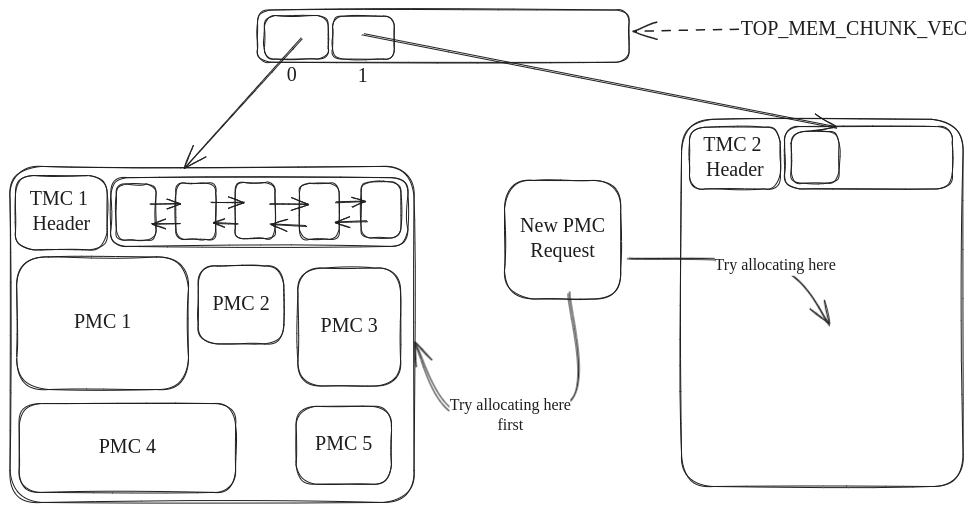
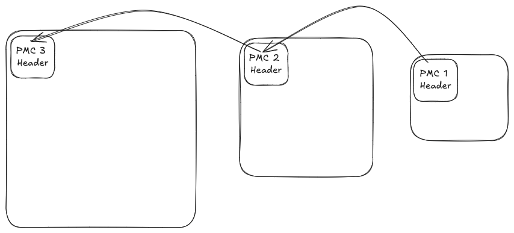

## Chunk Resizing

What happens when the space occupied by a memory chunk is not enough? There are 2 cases here:

i) When the Top memory chunk space is not enough.  
ii) When the Process memory chunk space is not enough.

Both cases need different handling.

#### Case 1: Top Memory Chunk Space Exceeded

Top memory chunk space can be exceeded when we try to get a process memory chunk in a particular scope. What do we do when we don't have enough space for a process memory chunk inside the top memory chunk?

It is for this purpose, that we maintain a TOP_MEM_CHUNK_VEC *(A global array of pointers to top memory chunks)*.

When a process memory chunk cannot be allocated into a particular top memory chunk due to memory constraints, we allocate a new top memory chunk twice the size of the previous top memory chunk and the allocation of all the future process-level memory chunks will take place in the new top memory chunk

In the above-shown image, the new process memory chunk has no space for allocation in the top memory chunk. Hence, we create a new top memory chunk TMC2 and allocate the process memory chunk there.

**Note: The size of TMC2 is twice that of TMC1**

#### Case 2: Process Memory Chunk Space Exceeded

When allocating an object in a process memory chunk fails due to out-of-memory, we generate a new process memory chunk that's twice the size of the old one and allocate the object in the new process memory chunk.

But the problem here is that the process memory chunk object resides in the stack of the calling program. So, copying all the objects of the old one into the new one is not possible since the calling program might also have pointer variables pointing to the memory address occupied by the old process memory chunk.

To overcome this problem, the header of the old process memory chunk will contain a pointer that will point to this new process memory chunk. The lifecycle of the new process memory chunk is handled to be the same as the lifecycle of the old one.

[Back to Home](../../../readme.md)