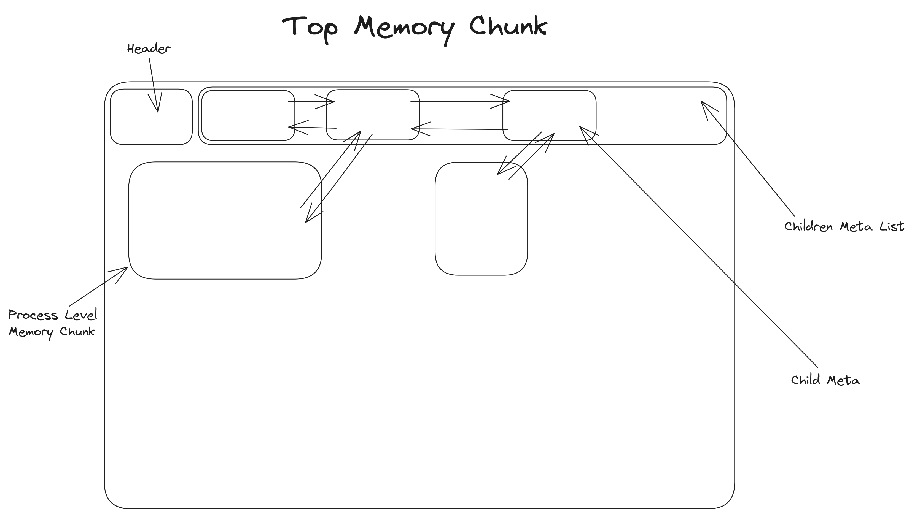
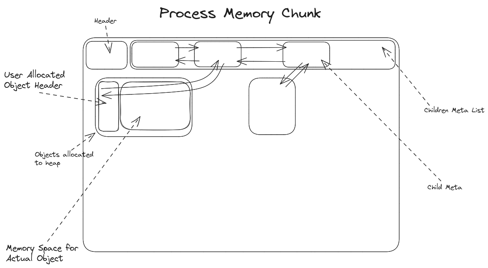

## Perfloc Internals

Perfloc creates a Top Memory Chunk *(similar to Java's virtual memory)* but objects cannot be directly allocated into this area. Each function, scope or process creates its own **Process Memory Chunk** that is created from the top memory chunk. Objects can be allocated into this process memory chunk. The lifetime of a process memory chunk does not exceed the function scope within which it is initialized. This ensures that the system calls are minimized.

### Collections Implementation

A custom basic collection library is implemented for Perfloc to use. This library just contains a basic vector implementation. 

Perfloc implements vectors that store elements by reference. So, have to be more considerate while freeing the memory.

### Top Memory Chunk

The top memory chunk is the only piece of memory we directly retrieve from the operating system. All the other process-level memory chunks are retrieved from the top memory chunk. This makes the top memory chunk kind of like a virtual memory that scales as per need.

Regions of the Top Memory Chunk can be divided into 3:

i) Header - contains various useful meta-information about the top memory chunk itself.

ii) Children Meta List - It is a list of children meta where each child meta corresponds to a process-level memory chunk and points to its location. There's also a doubly-pointer between each consecutive element in the Children meta list.

iii) Allocation Memory -  The rest of the region is where the actual memory is allocated for process-level memory chunks. The process-level memory chunks are the areas where the mutator program's objects are allocated.

Each process-level memory chunk is pointed to, by a corresponding meta from the children meta list from the top memory chunk. The reverse is also true *(Each process-level memory chunk also has a pointer to its child object meta in the top memory chunk)*. The reason for the existence of this doubly-pointer will be explained in the future.

### Process Memory Chunk

Process memory chunks are part of the top-level memory chunk. While top-level memory chunks comprise more process memory chunks, process-level memory chunks comprise actual objects that the user wants to allocate in the heap.

The architecture of the process memory chunk is not so different from the top memory chunk in this aspect

We store the object as well as a header for each object which contains a pointer back to the corresponding child meta of the object from the process memory chunk. This will be used during object deletion.

[Back to Home](../readme.md)